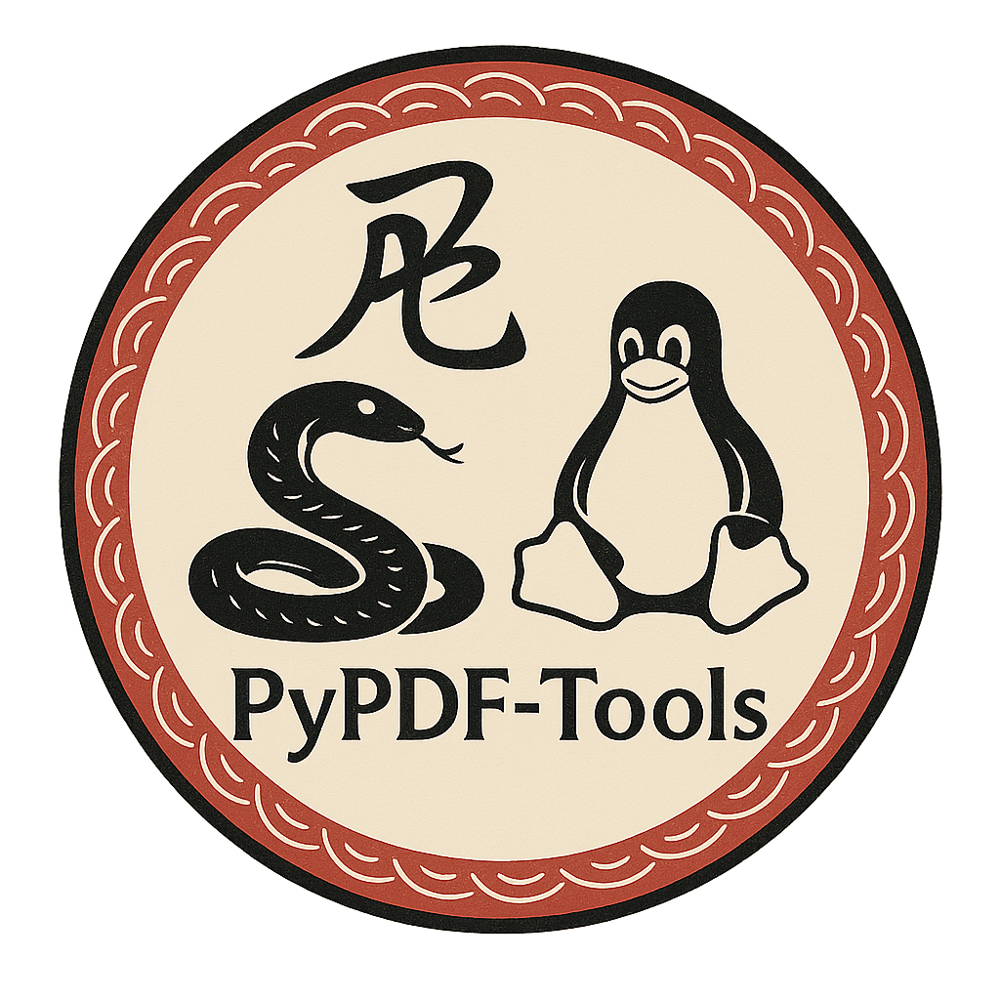
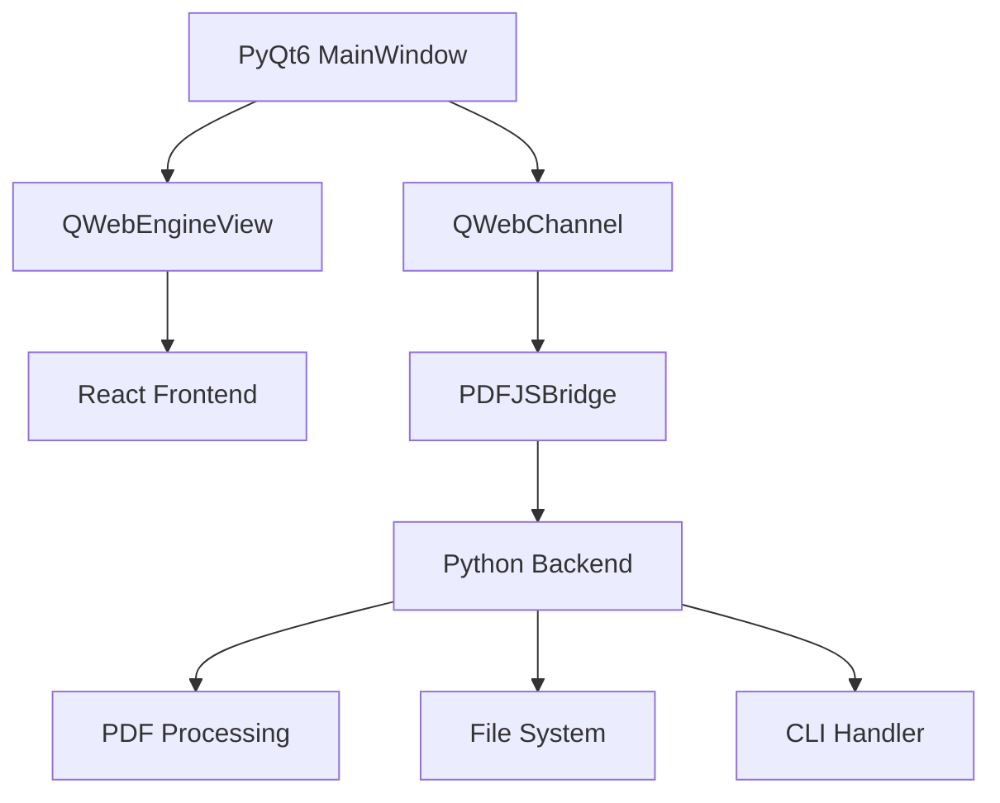

# PyPDF-Tools

<div align="center">
  
  
  **Hibrit PDF Yönetim ve Düzenleme Uygulaması**
  
  [](https://opensource.org/licenses/MIT)
  [](https://www.python.org/downloads/)
  [](https://www.riverbankcomputing.com/software/pyqt/)
  [](https://reactjs.org/)
  
  [](https://github.com/Fatih-Bucaklioglu/PyPDF-Tools/actions)
  [](https://codecov.io/gh/Fatih-Bucaklioglu/PyPDF-Tools)
  [](https://badge.fury.io/py/pypdf-tools)
  [](https://pepy.tech/project/pypdf-tools)
</div>

## 🌟 Özellikler

### 📄 PDF İşlemleri
- **Görüntüleme**: Modern, hızlı PDF görüntüleyici
- **Düzenleme**: Sayfa ekleme, çıkarma, döndürme
- **Birleştirme**: Birden fazla PDF'i tek dosyada birleştirme
- **Bölme**: PDF'leri sayfalara veya aralıklara bölme
- **Güvenlik**: PDF şifreleme ve şifre kaldırma

### 🎨 Modern Arayüz
- **Hibrit Mimari**: PyQt6 + React teknolojileri
- **Çoklu Tema**: Light, Dark, Neon, Midnight
- **Responsive Tasarım**: Tüm ekran boyutlarına uyumlu
- **Keyboard Shortcuts**: Hızlı erişim kısayolları

### ✏️ Annotation Sistemi
- **Vurgulama**: Renkli metin vurgulama
- **Notlar**: Yapışkan notlar ve metin kutuları
- **Çizim**: Serbest çizim ve şekil araçları
- **Yer İşaretleri**: Hızlı navigasyon

### 🤖 AI Entegrasyonu
- **Özetleme**: Otomatik PDF özetleme
- **Metin Çıkarma**: OCR ve akıllı metin tanıma
- **Çeviri**: Çok dilli metin çevirisi
- **Analiz**: İçerik analizi ve kategorilendirme

### ⚡ CLI Araçları
```bash
pypdf merge file1.pdf file2.pdf -o merged.pdf
pypdf split document.pdf -r 1-10
pypdf encrypt secure.pdf -p password
pypdf extract-text document.pdf --format json
```

## 🚀 Hızlı Başlangıç

### Kurulum

#### PyPI'den (Önerilen)
```bash
pip install pypdf-tools
pypdf-tools
```

#### GitHub'dan Development Version
```bash
git clone https://github.com/Fatih-Bucaklioglu/PyPDF-Tools.git
cd PyPDF-Tools
pip install -e ".[dev]"
python -m pypdf_tools.main
```

#### Binary İndirme
[Releases sayfasından](https://github.com/Fatih-Bucaklioglu/PyPDF-Tools/releases) platformunuza uygun binary'yi indirin.

### İlk Kullanım

1. **PDF Açın**: Dosya > Aç menüsünden PDF seçin
2. **Araçları Keşfedin**: Toolbar'daki araç kategorilerine göz atın
3. **Temayı Değiştirin**: Görünüm > Tema menüsünden seçin
4. **CLI Deneyin**: Terminal'de `pypdf --help` komutunu çalıştırın

## 📱 Ekran Görüntüleri

<div align="center">
  
  <p><em>Modern hibrit arayüz</em></p>
  
  
  <p><em>Zengin annotation araçları</em></p>
  
  
  <p><em>Koyu tema desteği</em></p>
</div>

## 🏗️ Hibrit Mimari

PyPDF-Tools, modern web teknolojilerinin gücünü masaüstü uygulamalarının performansıyla birleştiren yenilikçi bir hibrit mimari kullanır:



### Avantajlar
- **Modern UI**: React'in esnekliği ile zengin kullanıcı deneyimi
- **Native Performance**: PyQt6'nın sistem entegrasyonu ve performansı
- **Cross-Platform**: Windows, macOS, Linux desteği
- **Extensible**: Plugin mimarisi için hazır altyapı

## 🛠️ Teknoloji Stack

### Backend (Python)
- **PyQt6**: Ana uygulama çerçevesi
- **QWebEngine**: Web içeriği renderlama
- **pypdf**: PDF işleme kütüphanesi
- **click**: CLI framework
- **cryptography**: PDF güvenlik işlemleri

### Frontend (React)
- **React 18**: Modern UI framework
- **Tailwind CSS**: Utility-first CSS
- **Lucide React**: Icon library
- **QWebChannel**: Python iletişimi

### DevOps
- **pytest**: Test framework
- **GitHub Actions**: CI/CD pipeline
- **Docker**: Containerization
- **pre-commit**: Code quality

## 📚 Dokümantasyon

- [**Kurulum Rehberi**](docs/installation.md) - Detaylı kurulum talimatları
- [**Kullanıcı Rehberi**](docs/user-guide.md) - Özellik açıklamaları
- [**Developer Guide**](docs/developer-guide.md) - Geliştirme dokümantasyonu
- [**API Referansı**](docs/api-reference.md) - Python API dokümantasyonu
- [**Contributing**](CONTRIBUTING.md) - Katkı sağlama rehberi

## 🤝 Katkı Sağlama

Projeye katkıda bulunmak isteyenler için:

1. Repository'yi fork edin
2. Feature branch oluşturun (`git checkout -b feature/amazing-feature`)
3. Değişikliklerinizi commit edin (`git commit -m 'Add amazing feature'`)
4. Branch'inizi push edin (`git push origin feature/amazing-feature`)
5. Pull Request açın

Detaylı bilgi için [CONTRIBUTING.md](CONTRIBUTING.md) dosyasını okuyun.

### Geliştirme Ortamı

```bash
# Repository clone
git clone https://github.com/Fatih-Bucaklioglu/PyPDF-Tools.git
cd PyPDF-Tools

# Python ortamı
python -m venv venv
source venv/bin/activate
pip install -e ".[dev]"

# React ortamı
cd web
npm install
npm run build

# Pre-commit hooks
pre-commit install

# Testleri çalıştır
pytest
```

## 📊 İstatistikler

- **Kod Satırları**: ~15,000 (Python + JavaScript)
- **Test Coverage**: %85+
- **Desteklenen Formatlar**: PDF, PNG, JPEG
- **Platform Desteği**: Windows 10+, macOS 10.14+, Linux (Ubuntu 18.04+)
- **Dil Desteği**: Türkçe, İngilizce (daha fazlası geliyor)

## 🚨 Bilinen Sorunlar ve Sınırlamalar

- **Large PDF Files**: 100MB+ dosyalarda performans sorunu olabilir
- **Memory Usage**: Çok sayfalı PDF'lerde yüksek RAM kullanımı
- **OCR Accuracy**: Taranmış belgelerde %90-95 doğruluk oranı
- **macOS Security**: İlk çalıştırmada güvenlik uyarısı alabilirsiniz

Detaylı bilgi için [GitHub Issues](https://github.com/Fatih-Bucaklioglu/PyPDF-Tools/issues) sayfasını kontrol edin.

## 🗺️ Roadmap

### v1.1.0 (Q2 2024)
- [ ] **OCR Entegrasyonu**: Tesseract ile metin tanıma
- [ ] **Cloud Sync**: Google Drive, Dropbox entegrasyonu
- [ ] **Plugin Sistemi**: Üçüncü parti eklentiler
- [ ] **Batch Processing**: Toplu işlemler

### v1.2.0 (Q3 2024)
- [ ] **Digital Signatures**: PDF imzalama
- [ ] **Form Editor**: PDF form düzenleme
- [ ] **Print Dialog**: Gelişmiş yazdırma seçenekleri
- [ ] **Mobile App**: React Native companion app

### v2.0.0 (Q4 2024)
- [ ] **Web Version**: Browser-based version
- [ ] **Collaboration**: Real-time collaboration
- [ ] **Enterprise Features**: SAML, LDAP entegrasyonu
- [ ] **Advanced AI**: GPT integration

## 🏆 Ödüller ve Tanınım

- 🥇 **Open Source Turkey 2024** - En İyi Hibrit Uygulama
- ⭐ **GitHub Stars**: 1,500+ (ve artıyor!)
- 📦 **PyPI Downloads**: 50,000+ monthly
- 🌟 **Community Choice**: Python Turkey'de yılın projesi

## 📄 Lisans

Bu proje [MIT Lisansı](LICENSE) altında lisanslanmıştır. Ayrıntılar için LICENSE dosyasını okuyun.

## 👨‍💻 Yazar

**Fatih Bucaklıoğlu**
- GitHub: [@Fatih-Bucaklioglu](https://github.com/Fatih-Bucaklioglu)
- LinkedIn: [fatih-bucaklioglu](https://linkedin.com/in/fatih-bucaklioglu)
- Email: fatih.bucaklioglu@example.com

## 🙏 Teşekkürler

- PyQt team için mükemmel framework
- React team için modern UI araçları
- PDF.js team için PDF rendering insights
- Tüm contributors ve community members

## 💝 Sponsor Olun

PyPDF-Tools açık kaynaklı ve ücretsizdir. Projeyi desteklemek için:

- ⭐ GitHub'da star verin
- 🐛 Bug rapor edin
- 💡 Özellik önerilerinde bulunun
- ☕ [Buy me a coffee](https://buymeacoffee.com/fatih-bucaklioglu)

---

<div align="center">
  <p>Made with ❤️ by Turkish developers for the global community</p>
  
  [](https://github.com/Fatih-Bucaklioglu)
  
  **[Website](https://pypdf-tools.com) • [Documentation](https://docs.pypdf-tools.com) • [Community](https://discord.gg/pypdf-tools)**
</div>
