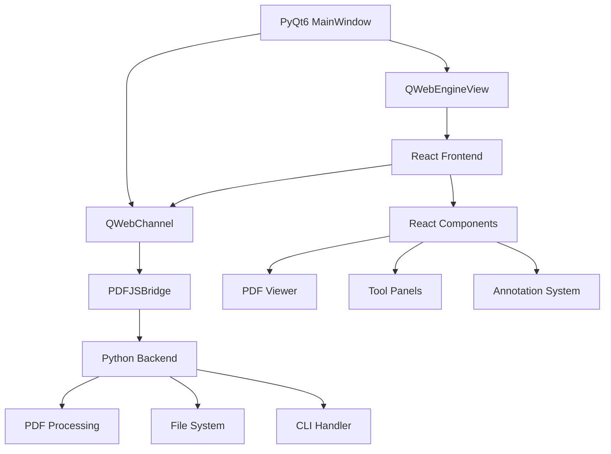

# PyPDF-Tools Geliştirici Rehberi

Bu rehber PyPDF-Tools hibrit uygulamasının geliştirme süreçlerini, mimariyi ve best practice'leri açıklar.

## İçindekiler

- [Hibrit Mimari](#hibrit-mimari)
- [Geliştirme Ortamı Kurulumu](#geliştirme-ortamı-kurulumu)
- [Proje Yapısı](#proje-yapısı)
- [Python-React İletişimi](#python-react-İletişimi)
- [Build ve Deploy Süreci](#build-ve-deploy-süreci)
- [Test Stratejisi](#test-stratejisi)
- [Debug Teknikleri](#debug-teknikleri)

## Hibrit Mimari

PyPDF-Tools, modern web teknolojilerinin gücünü masaüstü uygulamaların yetenekleriyle birleştiren hibrit bir mimari kullanır.

### Mimari Bileşenler



### Teknoloji Stack

#### Backend (Python)
- **PyQt6**: Ana uygulama çerçevesi
- **QWebEngineView**: Web içeriği renderlama
- **QWebChannel**: Python-JS köprüsü
- **pypdf/PyPDF2**: PDF işleme
- **click**: CLI interface
- **pytest**: Test framework

#### Frontend (React)
- **React 18**: Modern UI framework
- **Tailwind CSS**: Utility-first styling
- **Lucide React**: Icon library
- **QWebChannel JS**: Python communication

### Veri Akışı

1. **Kullanıcı Etkileşimi**: React bileşenlerinde
2. **Event Handling**: JavaScript event handlers
3. **Bridge Communication**: QWebChannel üzerinden
4. **Python Processing**: Backend işlemleri
5. **Response**: JavaScript callback'leri
6. **UI Update**: React state güncellemeleri

## Geliştirme Ortamı Kurulumu

### Gereksinimler

**Sistem Gereksinimleri:**
- Python 3.8+
- Node.js 16+
- Git
- PyQt6 sistem bağımlılıkları

**Platform-Specific:**

**Ubuntu/Debian:**
```bash
sudo apt update
sudo apt install python3-dev python3-pip nodejs npm
sudo apt install qt6-base-dev libgl1-mesa-glx
```

**macOS:**
```bash
brew install python node
# PyQt6 Homebrew ile kurulabilir
```

**Windows:**
```bash
# Python ve Node.js'i resmi sitelerden indirin
# Visual Studio Build Tools gerekebilir
```

### Detaylı Kurulum

#### 1. Repository Clone

```bash
git clone https://github.com/Fatih-Bucaklioglu/PyPDF-Tools.git
cd PyPDF-Tools
```

#### 2. Python Ortamı

```bash
# Virtual environment oluştur
python -m venv venv

# Aktifleştir
source venv/bin/activate  # Linux/Mac
# veya
venv\Scripts\activate     # Windows

# Dependencies yükle
pip install -e ".[dev,test]"
```

#### 3. React Ortamı

```bash
cd web
npm install

# Development server (opsiyonel)
npm start

# Production build
npm run build
```

#### 4. Pre-commit Hooks

```bash
pip install pre-commit
pre-commit install
```

### IDE Konfigürasyonu

#### Visual Studio Code

**.vscode/settings.json:**
```json
{
  "python.defaultInterpreterPath": "./venv/bin/python",
  "python.linting.enabled": true,
  "python.linting.flake8Enabled": true,
  "python.formatting.provider": "black",
  "eslint.workingDirectories": ["web"],
  "editor.formatOnSave": true,
  "python.testing.pytestEnabled": true,
  "python.testing.pytestArgs": ["tests"]
}
```

#### PyCharm

1. Project Interpreter'i `venv/bin/python` olarak ayarla
2. Code Style'ı Black formatter için yapılandır  
3. Test Runner'ı pytest olarak ayarla
4. JavaScript module'unu `web/` dizini için aktifleştir

## Proje Yapısı

```
PyPDF-Tools/
├── src/pypdf_tools/           # Python source code
│   ├── __init__.py
│   ├── _version.py           # Version info
│   ├── main.py              # Ana uygulama
│   ├── features/
│   │   ├── pdf_viewer.py    # PDF viewer widget
│   │   └── ...
│   └── cli/
│       └── cli_handler.py   # CLI commands
├── web/                     # React frontend
│   ├── public/
│   ├── src/
│   │   ├── components/      # React components
│   │   ├── hooks/          # Custom hooks
│   │   ├── utils/          # Utilities
│   │   └── App.jsx         # Main App
│   ├── package.json
│   └── build/              # Production build
├── tests/                  # Python tests
│   ├── test_app.py
│   ├── test_bridge.py
│   └── fixtures/
├── docs/                   # Dokümantasyon
├── .github/workflows/      # CI/CD
├── requirements/           # Dependency files
├── pyproject.toml         # Python config
├── setup.py              # Setup script
└── README.md
```

### Önemli Dosyalar

#### `src/pypdf_tools/main.py`
Ana uygulama entry point'i. QMainWindow ve menü sistemi.

#### `src/pypdf_tools/features/pdf_viewer.py`
- `PDFViewerWidget`: QWebEngineView wrapper
- `PDFJSBridge`: Python-JS communication bridge
- `PDFViewerContainer`: Widget container

#### `web/src/components/EmbeddedPDFViewer.jsx`
Ana React bileşeni. PDF görüntüleme ve tool management.

## Python-React İletişimi

### QWebChannel Köprüsü

#### Python Tarafı (PDFJSBridge)

```python
class PDFJSBridge(QObject):
    # Python'dan React'e sinyaller
    pdfDataChanged = pyqtSignal(str)
    themeChanged = pyqtSignal(str)
    
    # React'den Python'a slot'lar
    @pyqtSlot(str, result=str)
    def onToolAction(self, action_data: str) -> str:
        data = json.loads(action_data)
        tool_id = data.get('toolId')
        # Tool işlemi...
        return json.dumps({'success': True})
```

#### JavaScript Tarafı

```javascript
// QWebChannel bağlantısı
new QWebChannel(qt.webChannelTransport, function(channel) {
    const bridge = channel.objects.pdfBridge;
    
    // Python'dan gelen sinyaller
    bridge.pdfDataChanged.connect(function(jsonData) {
        const pdfData = JSON.parse(jsonData);
        setPdfData(pdfData);
    });
    
    // Python'a veri gönderme
    const result = bridge.onToolAction(JSON.stringify({
        toolId: 'zoom-in',
        data: { zoom: 100 }
    }));
});
```

### Veri Formatları

#### PDF Data Format
```json
{
    "filePath": "/path/to/document.pdf",
    "fileName": "document.pdf",
    "fileSize": 1024000,
    "totalPages": 15,
    "metadata": {
        "title": "Document Title",
        "author": "Author Name"
    }
}
```

#### Tool Action Format
```json
{
    "toolId": "zoom-in",
    "data": {
        "currentPage": 5,
        "zoom": 100,
        "selectedText": "Sample text"
    }
}
```

### Error Handling

```python
@pyqtSlot(str, result=str)
def onToolAction(self, action_data: str) -> str:
    try:
        data = json.loads(action_data)
        result = self._process_tool_action(data)
        return json.dumps({'success': True, 'result': result})
    except Exception as e:
        return json.dumps({
            'success': False, 
            'error': str(e),
            'errorType': type(e).__name__
        })
```

## Build ve Deploy Süreci

### Development Build

```bash
# React development server
cd web && npm start

# Python uygulamasını çalıştır
python -m pypdf_tools.main
```

### Production Build

```bash
# 1. React build
cd web
npm run build

# 2. Python package build
cd ..
python -m build

# 3. Installation test
pip install dist/pypdf_tools-*.whl
```

### CI/CD Pipeline

GitHub Actions workflow:

1. **Frontend Build**: React uygulaması
2. **Backend Test**: Python testleri  
3. **Integration Test**: Hibrit uygulama testleri
4. **Package Build**: PyPI paketi
5. **Release**: GitHub release ve PyPI publish

### Docker Deployment

```dockerfile
FROM python:3.11-slim

# Node.js kurulumu
RUN apt-get update && apt-get install -y nodejs npm

# Python bağımlılıkları
COPY requirements.txt .
RUN pip install -r requirements.txt

# React build
COPY web/ ./web/
RUN cd web && npm install && npm run build

# Python uygulaması
COPY src/ ./src/
RUN pip install -e .

CMD ["python", "-m", "pypdf_tools.main"]
```

## Test Stratejisi

### Test Piramidi

```
    /\
   /  \     E2E Tests (az, yavaş)
  /____\
 /      \   Integration Tests (orta)
/________\  Unit Tests (çok, hızlı)
```

### Unit Tests

#### Python Tests
```python
# tests/test_bridge.py
def test_tool_action_zoom_in(bridge):
    action_data = json.dumps({
        'toolId': 'zoom-in',
        'data': {'zoom': 100}
    })
    result = bridge.onToolAction(action_data)
    result_data = json.loads(result)
    assert result_data['success'] is True
```

#### React Tests
```javascript
// web/src/components/__tests__/PDFViewer.test.jsx
test('handles zoom in action', () => {
    const mockToolAction = jest.fn();
    render(<PDFViewer onToolAction={mockToolAction} />);
    
    fireEvent.click(screen.getByRole('button', { name: 'Zoom In' }));
    expect(mockToolAction).toHaveBeenCalledWith('zoom-in', expect.any(Object));
});
```

### Integration Tests

```python
# tests/test_integration.py
def test_python_react_communication(qtbot, main_window):
    # PDF yükle
    main_window.load_pdf('tests/fixtures/sample.pdf')
    
    # React'den tool action gönder (simulasyon)
    bridge = main_window.pdf_viewer_container.pdf_viewer._bridge
    result = bridge.onToolAction('{"toolId": "zoom-in", "data": {}}')
    
    # Sonucu kontrol et
    assert json.loads(result)['success'] is True
```

### E2E Tests

```python
# tests/test_e2e.py  
def test_full_application_workflow(qtbot):
    app = QApplication.instance()
    main_window = MainWindow()
    
    # Dosya aç
    main_window.load_pdf('tests/fixtures/sample.pdf')
    qtbot.wait(1000)
    
    # Tool kullan
    # (Browser automation ile React UI'ı test et)
    
    # Sonucu kontrol et
    assert main_window.current_pdf_path is not None
```

### Test Coverage

```bash
# Python coverage
pytest --cov=src/pypdf_tools --cov-report=html

# React coverage  
cd web && npm test -- --coverage

# Combined coverage (manual)
# HTML reports'ları merge et
```

## Debug Teknikleri

### Python Debugging

#### PyQt Debugging
```python
import logging
logging.getLogger('PyQt6').setLevel(logging.DEBUG)

# Qt message handler
from PyQt6.QtCore import qInstallMessageHandler, QtMsgType

def qt_message_handler(mode, context, message):
    print(f"Qt {mode}: {message}")

qInstallMessageHandler(qt_message_handler)
```

#### QWebChannel Debugging
```python
# Bridge debugging
class PDFJSBridge(QObject):
    def __init__(self):
        super().__init__()
        self._debug = True
    
    @pyqtSlot(str, result=str)
    def onToolAction(self, action_data: str) -> str:
        if self._debug:
            print(f"Received action: {action_data}")
        
        try:
            result = self._process_action(action_data)
            if self._debug:
                print(f"Action result: {result}")
            return result
        except Exception as e:
            if self._debug:
                import traceback
                traceback.print_exc()
            raise
```

### React Debugging

#### Console Debugging
```javascript
// Debug QWebChannel
window.debugBridge = true;

const handleToolAction = (toolId, data) => {
    if (window.debugBridge) {
        console.log('Tool Action:', { toolId, data });
    }
    
    if (onToolAction) {
        onToolAction(toolId, data);
    }
};

// QWebChannel status
window.qt?.webChannelTransport && console.log('QWebChannel available');
```

#### React DevTools
```bash
# React DevTools browser extension kullan
# Component state'lerini inspect et
```

### Network ve IPC Debugging

#### QWebChannel Mesajlarını İnceleme
```python
# QWebChannel transport'u monkey patch
original_send = QWebChannelTransport.send

def debug_send(self, data):
    print(f"QWebChannel Send: {data}")
    return original_send(self, data)

QWebChannelTransport.send = debug_send
```

### Performance Debugging

#### Python Profiling
```python
import cProfile
import pstats

def profile_pdf_load():
    pr = cProfile.Profile()
    pr.enable()
    
    # PDF yükleme kodu
    pdf_viewer.load_pdf('large_document.pdf')
    
    pr.disable()
    stats = pstats.Stats(pr)
    stats.sort_stats('cumulative').print_stats(10)
```

#### React Performance
```javascript
// React Profiler
import { Profiler } from 'react';

function onRenderCallback(id, phase, actualDuration) {
    console.log(`${id} (${phase}): ${actualDuration}ms`);
}

<Profiler id="PDFViewer" onRender={onRenderCallback}>
    <PDFViewer {...props} />
</Profiler>
```

### Debug Araçları

#### VS Code Debug Configuration
```json
// .vscode/launch.json
{
    "version": "0.2.0",
    "configurations": [
        {
            "name": "PyPDF-Tools Debug",
            "type": "python",
            "request": "launch",
            "module": "pypdf_tools.main",
            "args": ["--no-splash"],
            "console": "integratedTerminal",
            "env": {
                "QT_QPA_PLATFORM": "xcb",
                "PYTHONPATH": "${workspaceFolder}/src"
            }
        }
    ]
}
```

#### Browser DevTools
```javascript
// Console'da kullanışlı komutlar
window.pdfViewerDebug = {
    getBridge: () => window.pdfBridge,
    getCurrentData: () => window.currentPdfData,
    testToolAction: (toolId, data) => {
        return window.pdfBridge?.onToolAction(JSON.stringify({
            toolId, data
        }));
    }
};
```

### Common Issues ve Çözümleri

#### QWebChannel Bağlantı Sorunları
```python
# Timeout'u artır
channel = QWebChannel()
channel.connectTo(transport)

# Connection test
QTimer.singleShot(5000, self._test_connection)
```

#### React Build Sorunları
```bash
# Cache temizle
rm -rf web/node_modules web/build
cd web && npm install && npm run build

# Dependency conflict kontrolü
npm ls
```

#### Memory Leak Detection
```python
import tracemalloc

tracemalloc.start()

# Uygulama çalıştır
app.exec()

# Memory usage
current, peak = tracemalloc.get_traced_memory()
print(f"Current memory usage: {current / 1024 / 1024:.1f} MB")
print(f"Peak memory usage: {peak / 1024 / 1024:.1f} MB")
```

## Best Practices

### Kod Organizasyonu
- Single Responsibility Principle
- Modüler yapı
- Clear naming conventions
- Comprehensive documentation

### Performance
- Lazy loading için React.lazy
- PDF chunk loading
- Memory efficient image handling
- Worker threads for heavy operations

### Security
- Input validation
- XSS protection
- File path sanitization
- Secure PDF processing

Bu rehber sürekli güncellenmektedir. Sorularınız için GitHub Issues kullanın.
